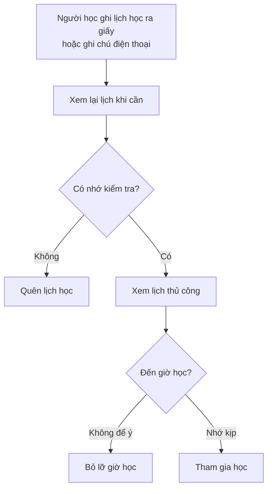
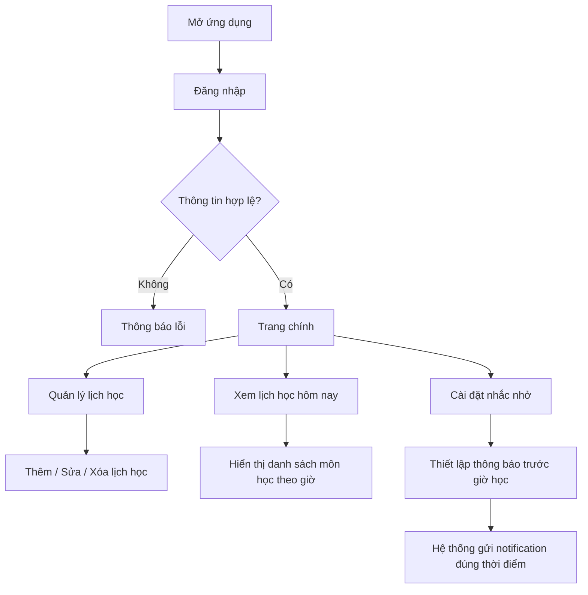

# BRD - Quản lí học tập và nhắc nhở

**Hệ thống hư cấu** : Quản lí học tập và nhắc nhở là hệ thống hư cấu được thiết kế cho mục đích học tập. Tên nhân vật, tổ chức và dữ liệu đều là giả lập

| Thông tin tài liệu | |
|---|---|
| **Dự án** | Hệ thống Quản lý học tập và nhắc nhở|
| **Phiên bản** | 1.0 |
| **Ngày tạo** | 16/04/2026 |
| **Người yêu cầu** | Ông Nguyễn Tùng Khánh — Khách hàng cá nhân |
| **Người tiếp nhận** | Ông Nguyễn Văn A — Trưởng dự án / Project Manager (PM), Công ty phần mềm XYZ |

## 1. Bối cảnh

rong bối cảnh hiện nay, sinh viên và người học thường phải quản lý nhiều môn học với lịch học khác nhau, bao gồm cả học trên lớp, học online và tự học. Tuy nhiên, việc ghi nhớ và theo dõi lịch học chủ yếu vẫn được thực hiện thủ công như ghi chép trên giấy, sử dụng ghi chú rời rạc hoặc các ứng dụng không chuyên biệt. Điều này dễ dẫn đến tình trạng quên lịch học, nhầm lẫn thời gian, hoặc không phân bổ thời gian học tập hợp lý.

Bên cạnh đó, phần lớn người học chưa có công cụ hỗ trợ nhắc nhở hiệu quả theo từng khung giờ cụ thể, đặc biệt là các thông báo trước giờ học. Việc thiếu một hệ thống quản lý tập trung khiến người dùng khó theo dõi được lịch học trong ngày, không có cái nhìn tổng quan về kế hoạch học tập, từ đó ảnh hưởng đến hiệu suất học tập và kỷ luật cá nhân.

Do đó, nhu cầu xây dựng một hệ thống quản lý học tập và nhắc nhở là cần thiết. Hệ thống này giúp người dùng dễ dàng tạo và quản lý lịch học, theo dõi các môn học trong ngày, đồng thời cung cấp tính năng nhắc nhở tự động trước giờ học. Mục tiêu là hỗ trợ người học chủ động hơn trong việc sắp xếp thời gian, hạn chế quên lịch và nâng cao hiệu quả học tập.

## 2. Mục tiêu nghiệp vụ

| Mã | Mục tiêu | Độ ưu tiên |
|----|---------|-----------|
| BO-01 | Cho phép người dùng đăng ký và đăng nhập để quản lý lịch học cá nhân | Cao |
| BO-02 | Số hóa việc quản lý lịch học, thay thế ghi chép thủ công | Cao |
| BO-03 | Hiển thị danh sách lịch học theo ngày (đặc biệt là “hôm nay”) một cách rõ ràng | Cao |
| BO-04 | Tự động nhắc nhở trước giờ học theo thời gian cài đặt | Cao |
| BO-05 | Cho phép người dùng thêm, sửa, xóa lịch học dễ dàng | Cao |
| BO-06 | Hỗ trợ tìm kiếm và lọc lịch học theo môn học hoặc ngày | Trung bình |
| BO-07 | Cho phép người dùng theo dõi toàn bộ lịch học theo tuần hoặc danh sách | Trung bình |
| BO-08 | Giao diện đơn giản, dễ sử dụng, phù hợp với sinh viên và người học | Cao |

## 3. Phạm vi dự án

### 3.1. Trong phạm vi (In-scope)

- Đăng ký và đăng nhập tài khoản người dùng.
- Quản lý lịch học cá nhân (thêm, sửa, xóa).
- Hiển thị danh sách lịch học theo ngày, đặc biệt là lịch học “hôm nay”.
- Sắp xếp lịch học theo thời gian trong ngày.
- Thiết lập nhắc nhở trước giờ học (notification trên thiết bị).
- Lưu trữ dữ liệu lịch học trên thiết bị (offline).
- Tìm kiếm và lọc lịch học theo môn học hoặc ngày.
- Giao diện đơn giản, dễ sử dụng trên ứng dụng di động.

### 3.2 Ngoài phạm vi (Out-of-scope)

- Đồng bộ dữ liệu giữa nhiều thiết bị (cloud sync).
- Đăng nhập bằng mạng xã hội (Google, Facebook).
- Thông báo qua email hoặc SMS.
- Tích hợp lịch học từ hệ thống bên ngoài (trường học).
- Báo cáo thống kê nâng cao (biểu đồ, phân tích học tập).
- Phiên bản web hoặc desktop.

## 4. Quy trình nghiệp vụ hiện tại (As-Is)

Vấn đề chính:
- Dễ quên lịch học do không có nhắc nhở.
- Lịch học phân tán, không tập trung.
- Không có cái nhìn tổng quan “hôm nay học gì”.
- Không thể chỉnh sửa hoặc quản lý lịch học hiệu quả.

# 5. Quy trình nghiệp vụ mong muốn (To-Be)

## 6. Quy tắc nghiệp vụ

| Mã | Quy tắc | Chi tiết |
|----|---------|---------|
| BR-01 | Đăng nhập hợp lệ | Người dùng phải đăng nhập để sử dụng hệ thống |
| BR-02 | Lịch học theo ngày | Mỗi lịch học phải gắn với một ngày trong tuần (1–7) |
| BR-03 | Thời gian hợp lệ | Thời gian học phải đúng định dạng (HH:mm) |
| BR-04 | Nhắc nhở | Hệ thống gửi thông báo trước giờ học (mặc định 10–15 phút) |
| BR-05 | Hiển thị hôm nay | Chỉ hiển thị các lịch học có ngày trùng với ngày hiện tại |
| BR-06 | Sắp xếp | Lịch học trong ngày phải được sắp xếp theo thời gian tăng dần |
| BR-07 | Quyền dữ liệu | Người dùng chỉ xem và quản lý lịch học của chính mình |
| BR-08 | Không trùng dữ liệu | Cho phép trùng giờ nhưng khuyến nghị người dùng tránh |
| BR-09 | Tìm kiếm | Tìm kiếm môn học không phân biệt hoa/thường |
| BR-10 | Lưu trữ | Dữ liệu được lưu cục bộ trên thiết bị (offline) |

---

## 7. Các bên liên quan (Stakeholders)

| Vai trò | Người đại diện | Mối quan tâm chính |
|---------|---------------|-------------------|
| Khách hàng (Customer) | Ông Nguyễn Tùng Khánh | Ứng dụng đơn giản, hỗ trợ học tập hiệu quả |
| Người học (End User) | Sinh viên | Xem lịch nhanh, có nhắc nhở, dễ sử dụng |
| Nhóm phát triển | Nhóm sinh viên / Dev | Hoàn thành đúng thời gian, dễ triển khai |

## 8. Ràng buộc và giả định

### Ràng buộc:
- Ứng dụng được phát triển bằng Flutter (mobile).
- Dữ liệu lưu trữ cục bộ bằng SQLite (offline).
- Không sử dụng server hoặc hệ thống backend trong giai đoạn đầu.
- Thời gian phát triển: **2–4 tuần**.

### Giả định:
- Người dùng sử dụng ứng dụng trên thiết bị cá nhân (điện thoại).
- Mỗi người dùng tự quản lý lịch học của mình.
- Số lượng lịch học không lớn (dưới 100 mục).
- Không yêu cầu bảo mật cao (ứng dụng cá nhân).

---

## 9. Tiêu chí nghiệm thu (Acceptance Criteria)

| Mã | Tiêu chí | Phương pháp kiểm tra |
|----|---------|---------------------|
| AC-01 | Đăng nhập thành công | Nhập đúng thông tin → vào hệ thống |
| AC-02 | Từ chối đăng nhập sai | Nhập sai → hiển thị lỗi |
| AC-03 | Thêm lịch học | Thêm → hiển thị trong danh sách |
| AC-04 | Hiển thị lịch hôm nay | Đúng ngày → hiển thị đúng dữ liệu |
| AC-05 | Sắp xếp lịch theo giờ | Danh sách hiển thị theo thứ tự tăng dần |
| AC-06 | Sửa / Xóa lịch học | Thao tác → dữ liệu cập nhật đúng |
| AC-07 | Nhắc nhở hoạt động | Trước giờ học → có notification |
| AC-08 | Tìm kiếm môn học | Nhập từ khóa → lọc đúng kết quả |
| AC-09 | Dữ liệu cá nhân | Không hiển thị dữ liệu người khác |
| AC-10 | Giao diện dễ sử dụng | Người dùng thao tác dễ dàng |

---

## 10. Lịch trình mong muốn

| Giai đoạn | Thời gian | Sản phẩm |
|-----------|----------|---------|
| Phân tích yêu cầu | Tuần 1 | Tài liệu BRD |
| Thiết kế & Phát triển | Tuần 2–3 | Ứng dụng Flutter |
| Kiểm thử | Tuần 4 | Hoàn thiện và sửa lỗi |
| Bàn giao | Cuối tuần 4 | Ứng dụng hoàn chỉnh |

---

## 11. Ghi chú triển khai hệ thống

### 11.1 Tổng quan kỹ thuật

- Hệ thống được xây dựng dưới dạng ứng dụng di động.
- Dữ liệu được lưu trữ trực tiếp trên thiết bị của người dùng.
- Ứng dụng hoạt động độc lập, không yêu cầu kết nối internet.

---

### 11.2 Nguyên tắc thiết kế

- Giao diện đơn giản, dễ sử dụng.
- Tối ưu tốc độ truy cập và hiển thị dữ liệu.
- Đảm bảo dữ liệu cá nhân của người dùng không bị chia sẻ.

---

### 11.3 Yêu cầu hệ thống

- Thiết bị chạy Android (phiên bản phổ biến).
- Cho phép gửi thông báo (notification).
- Dung lượng lưu trữ đủ để lưu lịch học.

---

### 11.4 Khả năng mở rộng

Trong tương lai, hệ thống có thể mở rộng:
- Đồng bộ dữ liệu giữa nhiều thiết bị.
- Tích hợp đăng nhập bằng tài khoản bên thứ ba.
- Bổ sung thống kê và báo cáo học tập.

---

*Ký duyệt:*

| | Họ tên | Chức vụ | Ngày |
|---|--------|--------|------|
| **Người yêu cầu** | Nguyễn Tùng Khánh | Khách hàng | 16/04/2026 |
| **Người tiếp nhận** | Nguyễn Văn A | Project Manager | 16/04/2026 |